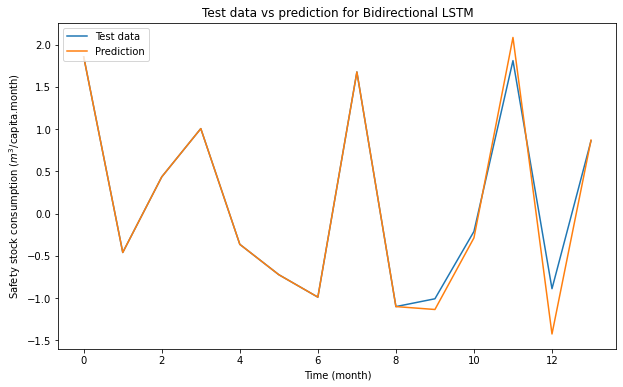

# Safety-Stock-Forecasts
企業庫存預測
(鑒於數據使用及保密規定，此處不提供任何關於數據資料之程式碼)

### Purpose and Summery
1. Cause
    - **Large amounts of data** that cannot be directly visualized
    - Enterprises can never know what the customer's consumption needs are, so they need to make predictions through a lot of data analysis to get relatively reasonable results.
    - If it is not possible to predict in advance how much goods should be reserved, and order goods when the reserves are completely gone. **The cost of sales will be greatly increased.**

2. Purpose  
&ensp;&ensp;&ensp;&ensp;In order to solve the problem that enterprises could not predict the amount of inventory which should be stored in advance, we developed a **safety stock forecast model** to analyze the amount of safety stock that needs to be prepared on the production line.

3. Contribution
    - Through the data provided by the enterprise, the correct prediction of the amount of safety stock can not only help the enterprise **prepare the required goods in advance**, **avoid the lack of goods that customers need to buy**, but also help them **manage the relationship with suppliers**. Also, suppliers can then know that the number of goods of the enterprise is lower than the amount of safety stock, and actively ask whether the company needs to supply.
    - Having company's own inventory allows manufacturers to have an advantage in **price negotiation** when buying goods in bulk.
    - **The time between ordering and delivery can be greatly reduced** by comparing your current inventory with the predicted safety stock.

### Technical Features
In our project project, we used Multivariate Bi-LSTM to build the model: We used the neural network model to predict the sequence, instead of the experience to determine the supplier's policy and successfully.  
1. **Data Source**  
Electronic inventory information set provided by the Enterprise
2. **Data Preprocessing**
    - Transposing Data
    - Data Normalizaiton
    - Data Standardizing
3. **Model Training**: Miltivarite Bi-LSTM
    - Shift the data
    - Split the data into training and testing dataset
    - Bi-LSTM Model Building
    - Check for Model Performance
4. **Model Testing**: Test for the model performance

### Technological breakthroughs and innovations
1. The use of **deep learning** to make predictions instead of intuitive experience in the past to determine the marketing policy of suppliers.
2. Focus on the importance of the quantity of goods and the importance of output value are analyzed, so as to assist enterprises to achieve reasonable allocation of inventory. Compared with the past manual observation and analysis, this model can not only reduce some human analysis errors, but also reduce the labor cost of enterprises.
